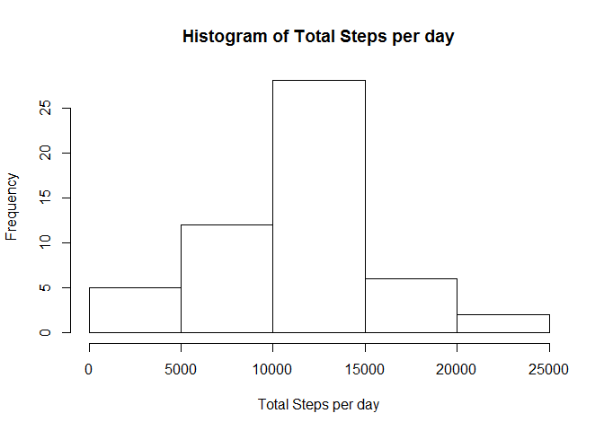
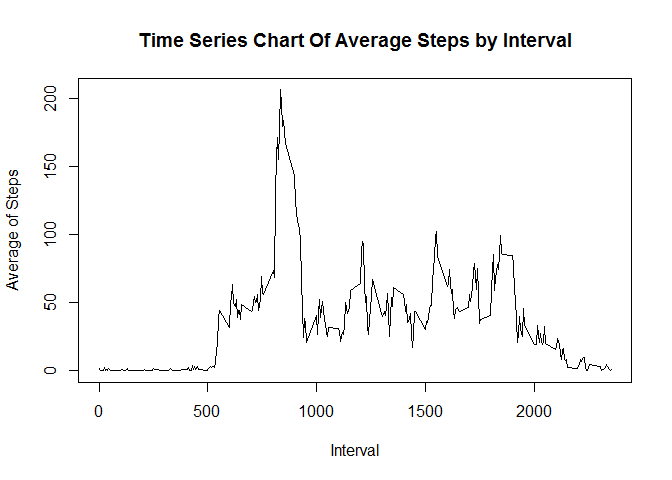
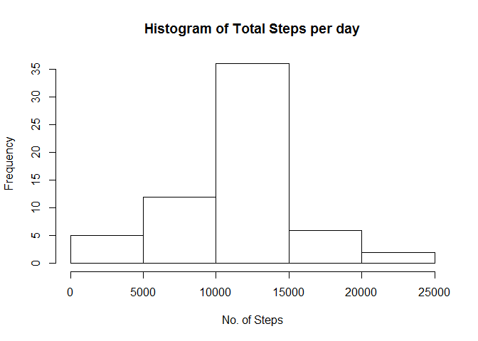
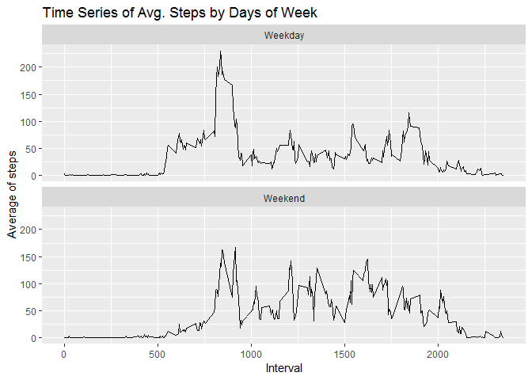

#Analysis of Activity Monitoring Data

##Reading the Data

Load required packages

```r
library(ggplot2)
library(dplyr)
```

```
## 
## Attaching package: 'dplyr'
```

```
## The following objects are masked from 'package:stats':
## 
##     filter, lag
```

```
## The following objects are masked from 'package:base':
## 
##     intersect, setdiff, setequal, union
```
Set relevant working directory and read the data


```r
setwd("repdata_data_activity")
data<-read.csv("activity.csv")
```

##Analysis Of Daily No. Of Steps

Remove NA from data. sum by dates for histogram and find median and Mean


```r
datamod <- data[is.na(data$steps) == FALSE,]
databydate <- datamod %>% group_by(date)
databydate <- databydate %>% summarize(totalsteps = sum(steps))
hist(databydate$totalsteps, xlab = "Total Steps per day", main = "Histogram of Total Steps per day")
```

<!-- -->


```r
mean(databydate$totalsteps)
```

```
## [1] 10766.19
```

```r
median(databydate$totalsteps)
```

```
## [1] 10765
```

##Average Daily Activity Pattern

Find Avg. steps by interval and plot time series


```r
databyinterval <- datamod %>% group_by(interval)
databyinterval <- databyinterval %>% summarize(avgsteps = mean(steps))
plot(databyinterval, type = "l", xlab = "Interval", ylab = "Average of Steps", main = "Time Series Chart Of Average Steps by Interval")
```

<!-- -->

##Input Missing Values

Filter data containing only NA and find number of NA 


```r
dataNA <- data[is.na(data$steps) == TRUE,]
length(dataNA$steps)
```

```
## [1] 2304
```

Replace the NA by average no. of steps for that interval


```r
for(i in 1: length(dataNA$steps)){
  for(j in 1: length (databyinterval$avgsteps)){
    if(dataNA[i,3] == databyinterval[j,1]){
      dataNA$steps = databyinterval$avgsteps
      break
    }
  }
}
```

##Analysis Of Total No. Of Steps For New Data

Form new data set and find total steps by date

```r
newdata<- rbind(datamod,dataNA)
newdatabydate <- newdata %>% group_by(date)
newdatabydate <- newdatabydate %>% summarize(totalsteps = sum(steps))
```


Plot histogram and find new Mean and Median

```r
hist(newdatabydate$totalsteps, xlab = "No. of Steps", main = "Histogram of Total Steps per day")
```

<!-- -->

```r
mean(newdatabydate$totalsteps)
```

```
## [1] 10766.19
```

```r
median(newdatabydate$totalsteps)
```

```
## [1] 10766.19
```

##Average Daily Activity Pattern By Weekday And Weekend

Create new Variable to identify Weekday and Weekend

```r
newdata$weekday <- weekdays(as.Date(newdata$date))
newdata$weekday <- gsub("Sunday", "Weekend", newdata$weekday)
newdata$weekday <- gsub("Saturday", "Weekend", newdata$weekday)
newdata$weekday <- gsub("Monday", "Weekday", newdata$weekday)
newdata$weekday <- gsub("Tuesday", "Weekday", newdata$weekday)
newdata$weekday <- gsub("Wednesday", "Weekday", newdata$weekday)
newdata$weekday <- gsub("Thursday", "Weekday", newdata$weekday)
newdata$weekday <- gsub("Friday", "Weekday", newdata$weekday)
```

Plot New Time Series of Avg. No. of Steps by Weekday/Weekend


```r
newdatabywkd <- newdata %>% group_by(weekday, interval)
newdatabywkd <- newdatabywkd %>% summarize(meansteps = mean(steps))
g<- ggplot(newdatabywkd, aes(x = interval, y = meansteps)) + labs(x = "Interval",y ="Average of steps",title="Time Series of Avg. Steps by Days of Week") + geom_line() + facet_wrap(~weekday, ncol=1)
g
```

<!-- -->
